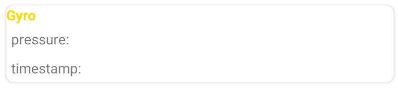

# GetSensorInfo
## 1 简介
本项目可以实时抓取Android手机上一些传感器数据，同时显示到屏幕上以及写入文件中，具体包括：

- 加速度计
- 距离传感器
- 陀螺仪
- 光线传感器
- 磁场传感器
- 旋转向量传感器

## 2 代码结构

本项目代码由4部分组成，分别是：

- logutil package
- sensorutil package
- uitiil package
- MainActivity和StaticVar

### 2.1 logutil package

该包包括一些将传感器数据写入文件的类，具体为：`LogCatcher`类，此类包括两个公有接口：

```java
public void write(float[] data, long timestamp);
```

将传感器数据`data`以及时间戳`timestamp`写入文件，具体文件路径为：==/storage/emulated/0/Android/data/me.junjie.getsensorinfo/files/Documents/..==

此文件夹下会写入6个文件，分别对应6个传感器。

```java
public void setStatus(boolean status);
```

设置是否写入，`status=false`不写入，`status=true`写入文件

### 2.2 sensorutil package

该包包括6个传感器的Helper类:

- AccHelper
- DistanceHelper
- GyroHelper
- LightHelper
- MagneticHelper
- RotVecHelper

主要功能是实时监听传感器数据，并通过消息队列Handler发送给UI线程。6个Helper结构大体一致(其实可以写个基类再继承的)，这里使用GyroHelper进行说明。

```java
public void registListener();
```

注册传感器，注册后开始监听

```java
@Override
public void onSensorChanged(SensorEvent event)
```

传感器监听接口，将接收到的数据通过Handler发送给UI线程。

### 2.3 uiutil package

此包负责UI显示的一些功能，主要使用的是ListView+自定义的Adapter进行适配，传感器分为两大类，一类是一次接收到3个信息，例如陀螺仪每次接收到x，y，z轴的角速度，另外一类是每次接收到一个信息，例如距离传感器，所以要将两种不同的界面适配到同一个ListView，两种不同的UI界面如下：




**AllSensorInfo**

保存不同数据的结构类，通过新建其对象，将数据存入`mData`达到更新UI数据的目的。

**MutiAdapter**

自定义适配器，规定UI更新显示的具体操作

```java
private static final int TYPE_GYRO = 0;
private static final int TYPE_ACC = 1;
private static final int TYPE_MAG = 2;
private static final int TYPE_ROT = 3;
private static final int TYPE_LIG = 4;
private static final int TYPE_DIS = 5;
```

不同种类的传感器标记，和switch语句一同使用，负责区分不同传感器。

```java
private ArrayList<Object> mData = null;
```

从UI线程发送过来的传感器数据包，下面部分代码负责解包，类型是`Object`意味着可以存放各种类型的数据，这里存放的是`AllSensorInfo`的各种子类。

```java
@Override
public int getCount();
```

获取`mData`中的元素个数，也就是ListView中的元素个数。

```java
@Override
public Object getItem(int position);
```

获取`mData`中的元素，也就是ListView中的元素信息。

```java
@Override
public int getItemViewType(int position);
```

根据`mData`中存放的不同数据类型，返回不同的传感器标记。

```java
private static class ViewHolderGyro{
    TextView gyroPitch;
    TextView gyroRoll;
    TextView gyroYaw;
    TextView gyroTime;
    TextView gyroName;
}
```

`ViewHolder`负责保存不同结构中具体控件引用，每个传感器对应不同Holder。

```java
@Override
public View getView(int position, View convertView, ViewGroup parent);
```

负责设置UI布局以及根据不同传感器更新UI布局。

### 2.4 MainActivity and StaticVar

**StaticVar**

包括主活动的上下文变量，以及不同传感器标记的枚举类，此枚举类在给消息队列`Handler`发送消息时区分不同传感器使用。

**MainActivity**

主活动，负责处理UI，以及各种数据的发送和接收。

## 3 github repo

https://github.com/SjjAugust/GetSensorInfo

